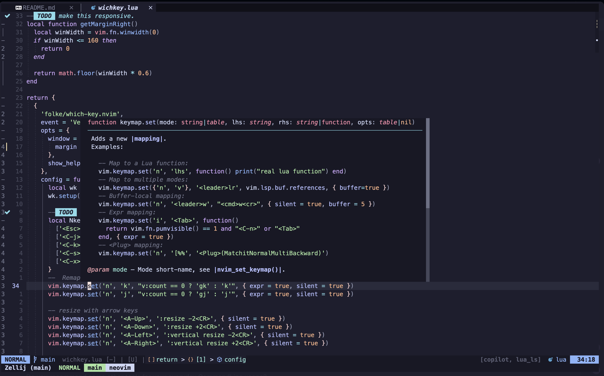
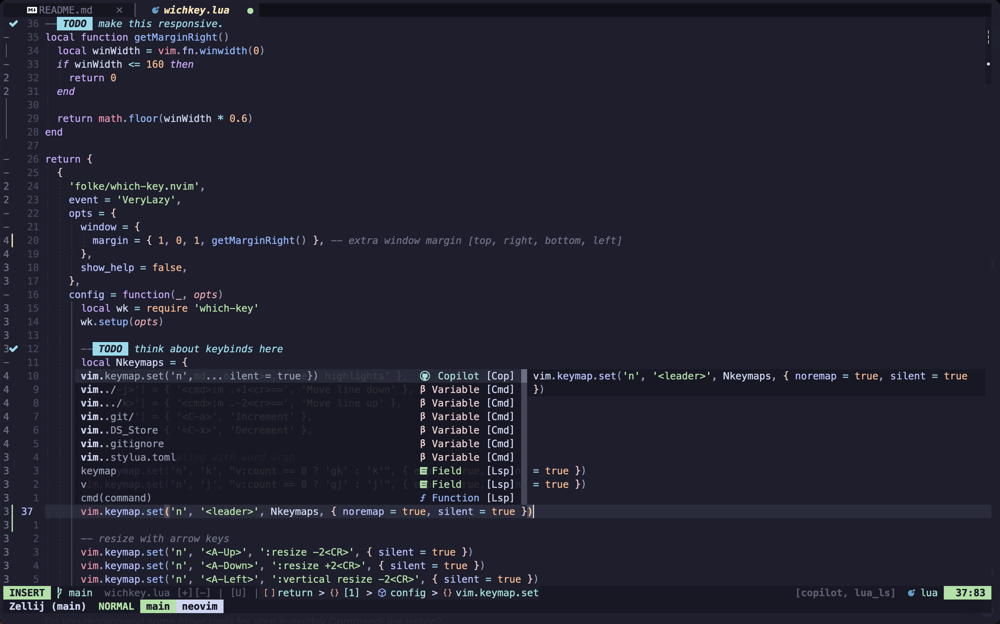
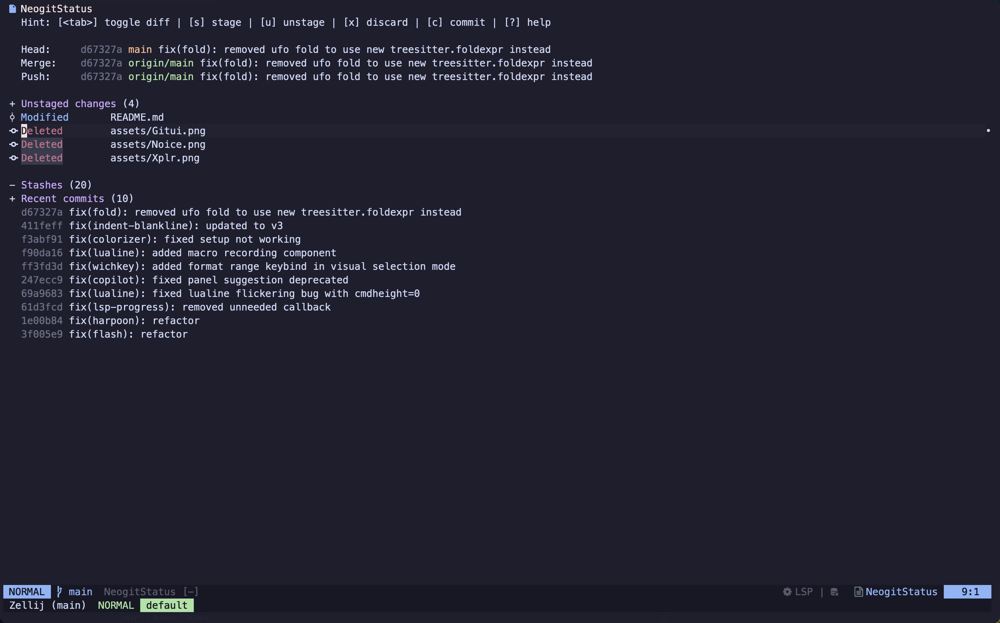
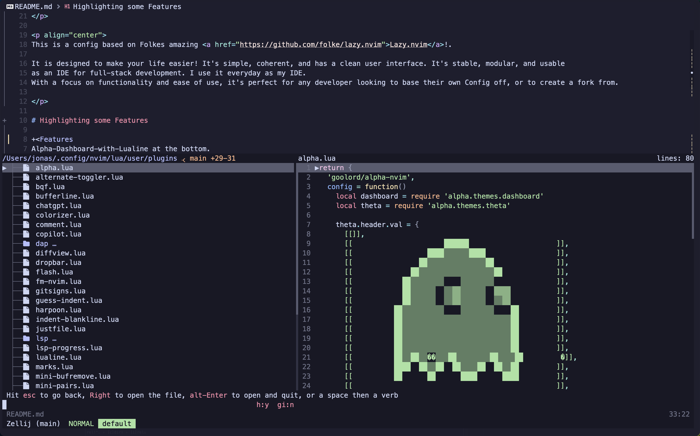
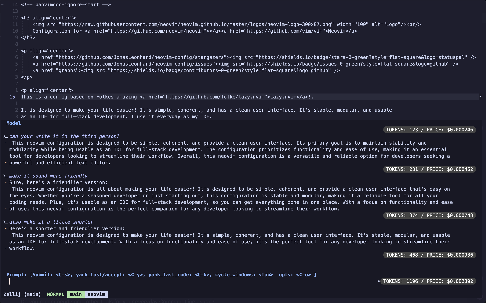
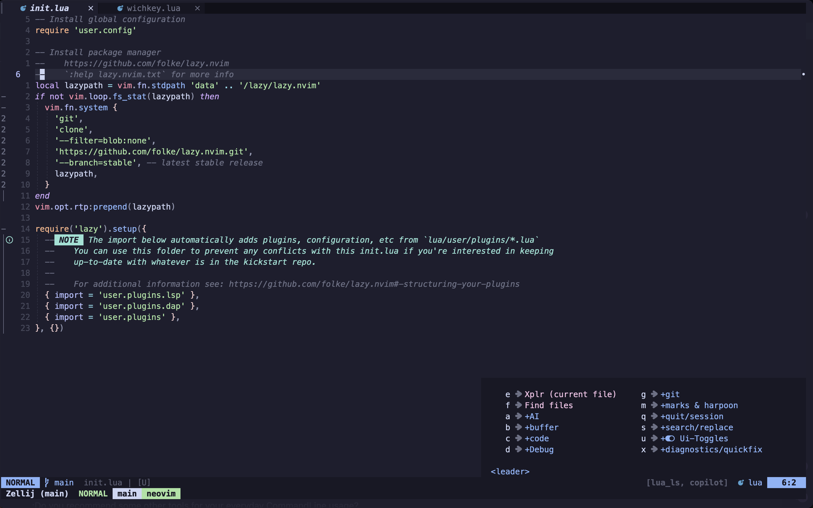
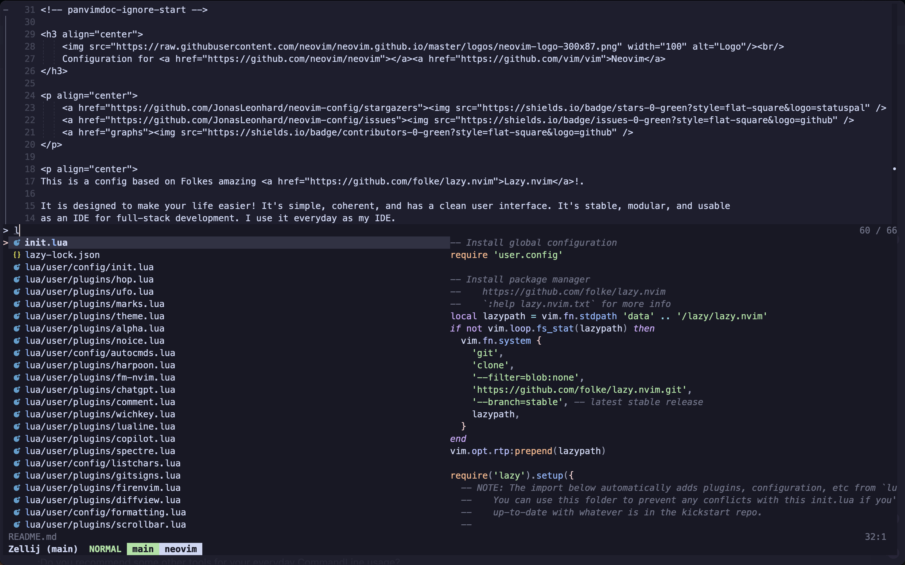
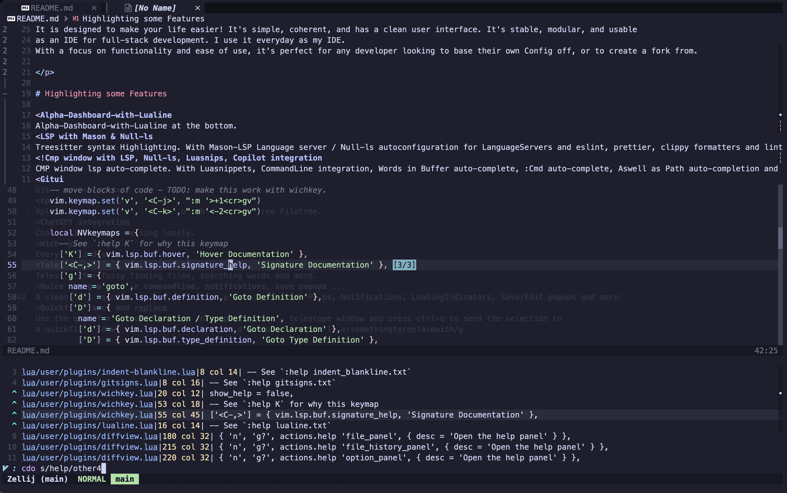

<!-- panvimdoc-ignore-start -->

<h3 align="center">
    <br/>
    Configuration for <a href="https://github.com/neovim/neovim"></a><a href="https://github.com/vim/vim">Neovim</a>
</h3>

<p align="center">
    <a href="https://github.com/JonasLeonhard/neovim-config/stargazers">
    <a href="https://github.com/JonasLeonhard/neovim-config/issues">
    <a href="graphs">
</p>

<p align="center">
This is a config based on Folkes amazing <a href="https://github.com/folke/lazy.nvim">Lazy.nvim</a>!.

It is designed to make your life easier! It's simple, coherent, and has a clean user interface. It's stable, modular, and usable
as an IDE for full-stack development. I use it everyday as my IDE.
With a focus on functionality and ease of use, it's perfect for any developer looking to base their own Config off, or to create a fork from.

</p>

# Highlighting some Features

+<
Alpha-Dashboard-with-Lualine at the bottom.
-<
-Treesitter syntax Highlighting. With Mason-LSP Language server / Null-ls autoconfiguration for LanguageServers and eslint, prettier, clippy formatters and linters.
-<
-CMP window lsp auto-complete. With Luasnippets, CommandLine integration, Words in Buffer auto-complete, :Cmd auto-complete, Aswell as Path auto-completion and Copilot integration.
-<
-Neogit via <leader>g.
-<
-Broot as a Fileexplorer instead of the usual Neotree Filetree.
-<
-ChatGPT if you are feeling lonely.
-<
-Every Keybind should be displayed inside of WhichKey.
-<
-Telescope for fuzzy finding files, searching words and more.
-<
-Use the bqf quickfix window to search and replace. Open a telescope window and press ctrl-q to send the selection to
-a quickfix window. Here use :h cdo or :h cfdo s/somethingtoreplace/somethingtoreplacewith/g

<br/>
...and alot more plugins. Checkout lua/user/plugins to see all plugins.

# How do i get started?

Clone this repository into your neovim configuration folder. Make sure to backup your old config first!

```bash
git clone https://github.com/JonasLeonhard/neovim-config ~/.config/nvim
```

# FAQ:

: Where can i find more awsome neovim plugins?

- Checkout <a href="https://github.com/rockerBOO/awesome-neovim/tree/main">Awsome Neovim</a>

:What tools do i need to install for this config?

- This config uses a bunch of cli tools to make your life easier.
  Checkout the following list:

- <a href="https://github.com/NeogitOrg/neogit">Neogit</a> w. \<leader\>gg.
  Alternatives to consider could be <a href="https://github.com/extrawurst/gitui">Gitui</a>. I like it slightly more than <a href="https://github.com/jesseduffield/lazygit">Lazygit</a>, but that comes down to personal preference. If you want
  to change this key.

- <a href="https://github.com/Canop/broot">Broot</a> Fileexplorer via <leader>e.
  The command is configured in fm-nvim.lua . You should be able to change it to the file explorer of your liking <a href="https://github.com/JonasLeonhard/fm-nvim">Fm-nvim</a>
  I use Broot instead of a Filetree installed in this config. I can really recommend giving it a try.
  You can find my Broot config here:
  <a href="https://github.com/JonasLeonhard/broot-config">Xplr-Config</a>
  If you want another good alternative, i recommend <a href="https://github.com/stevearc/oil.nvim">Oil.nvim</a>

- <a href="https://github.com/BurntSushi/ripgrep">Ripgrep</a> is used for Telescope search. This is not required, but i highly recommend it.

: What Keymap does this config use?

- you should find most of the keymap inside of lua/user/plugins/wichkey.lua

  :Do you recommend some other tools for your everyday CommandLine usage?

- Sure. Checkout this list:
- Starship.rs (a good looking Prompt. You can find my config here: https://github.com/JonasLeonhard/starship-config. It uses zshs builtin vi-mode to display your mode (see my .zshrc))
- <a href="https://github.com/JonasLeonhard/nushell-config">Nushell</a>
- or if you are using zsh: zsh-autosuggestions (auto-complete), zsh-syntax-highlighting
- Zoxide (smart cd)
- FzF aswell as Fzf-tab (fuzzy finder that can replace your builtin zsh Tab auto-complete window.)
- Zellij (a Terminal Multiplexer/Workspace manager. I feel like this is a little cleaner than your average Tmux config. Both are good and you should check them out. My config: https://github.com/JonasLeonhard/zellij-config)
- Eza (a better looking ls command, i recommend alias ls=eza)
- Bat (a better looking cat command, i recommend alias cat=bat)
- Alacritty Terminal Emulator (a terminal emulator with a builtin vi-mode. My config can be found at: https://github.com/JonasLeonhard/alacritty)

: Where can i find your .zshrc and or nushell config?

- Checkout this gist for zsh: https://gist.github.com/JonasLeonhard/de3103b923a59be26baf15ed18c1a8d0
- or https://github.com/JonasLeonhard/nushell-config for nushell

  :I have an Intelephense Licence, how do i get it setup?

- it should get automatically loaded from ~/intelephense/licence.txt

:I have a Copilot Licence, how do i register Copilot?

- to get started with copilot. Run:

```
  :CopilotAuth
```

:How does the ChatGPT API-Key get loaded?

- get your api key at: https://platform.openai.com, and add it to your ~/.zshrc as an env variable.

```bash
export OPENAI_API_KEY=YOUR_API_KEY
```

# Licence:

MIT Licence. Feel free to fork or use this repository to kickstart your own config. No need to credit me. And most importantly. Have fun!

# Credits:

- Folkes great Config: https://github.com/LazyVim/LazyVim
- Aswell as from https://github.com/lunarvim/lunarvim
- If you are looking for great Plugins to fit your use case better. Checkout https://github.com/rockerBOO/awesome-neovim/blob/main/README.md .
- Helix for some ui inspiration https://helix-editor.com/
